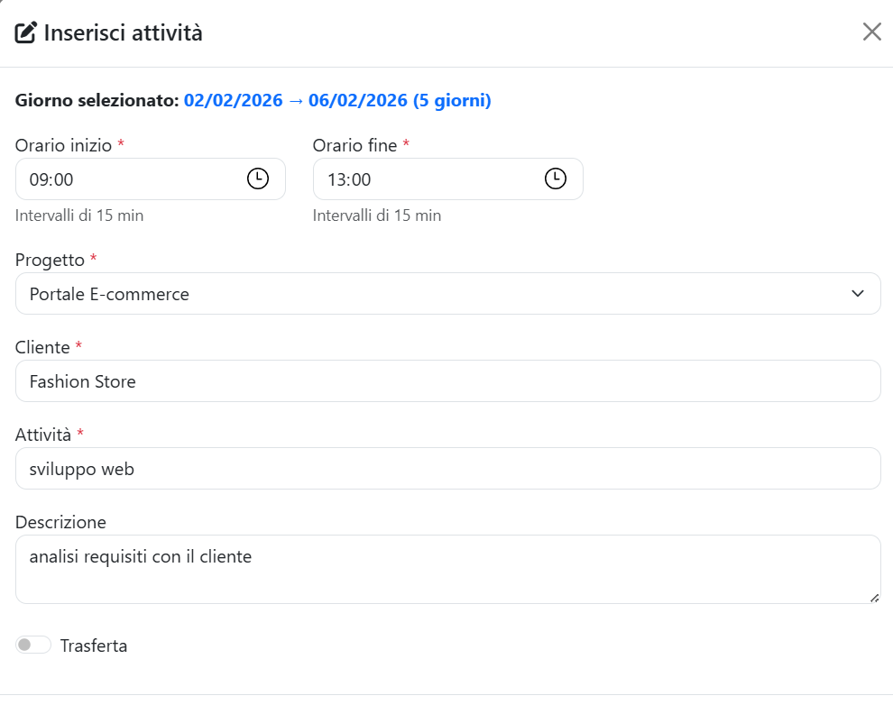
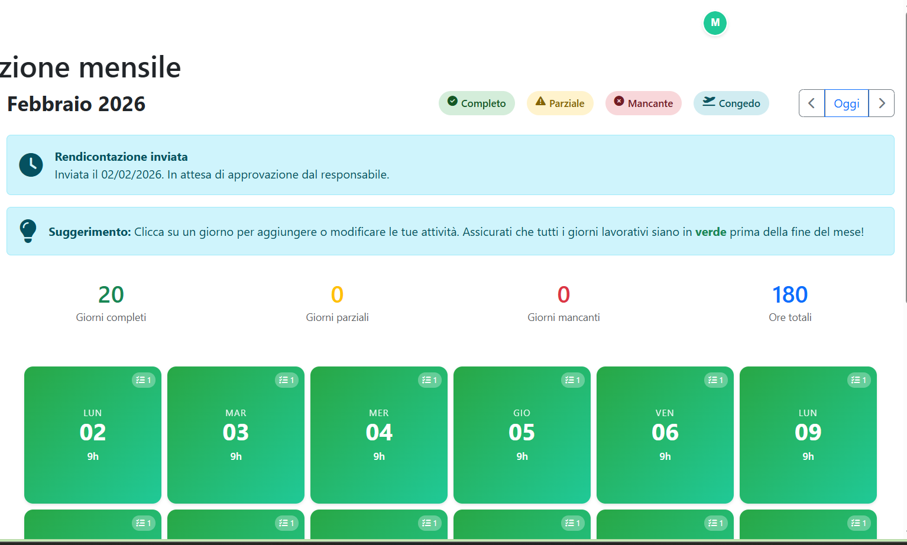
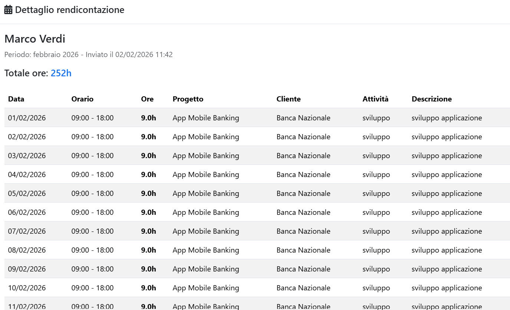
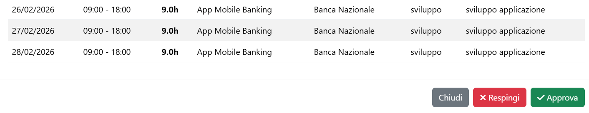
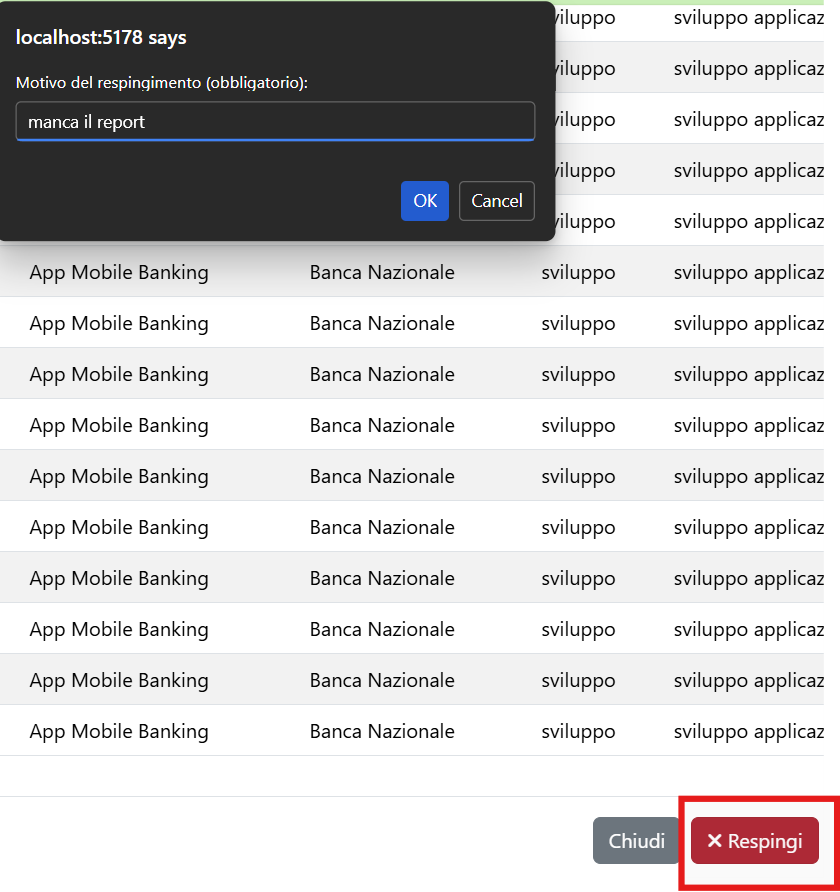
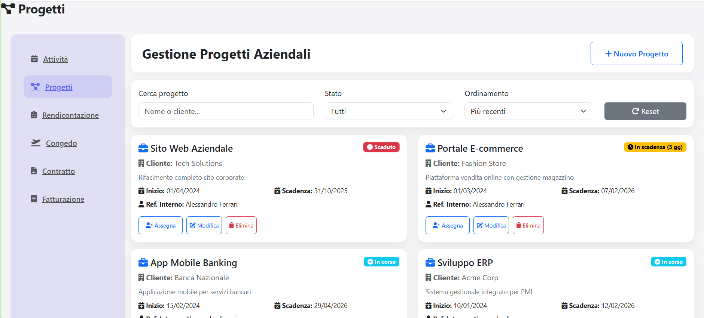
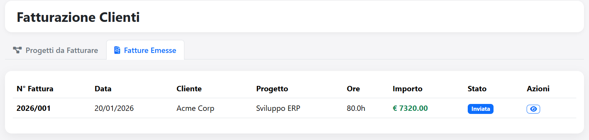

### Caso di Studio: Sistema di Rendicontazione e Fatturazione Attività
Laboratorio di Interfaccia Uomo-Macchina 

## Nascita dell'Esigenza

Contesto Aziendale

Un'azienda di consulenza IT con forte crescita nel settore dei servizi a valore ha evidenziato criticità nella gestione delle ore lavorate e nella conseguente fatturazione ai clienti. Questa necessità ha portato alla nascita del progetto **"Rendicontazione Attività"**.

# Obiettivo del Progetto
Il progetto prevede lo sviluppo di una piattaforma software che permetta di:

- Tracciare in maniera precisa le ore lavorate dai dipendenti
- Rendicontare mensilmente le attività svolte
- Approvare/respingere le rendicontazioni con feedback strutturato
- Fatturare automaticamente i clienti basandosi sulle ore approvate


## Analisi del Contesto

Struttura Aziendale

L'azienda è una realtà che conta circa 50 dipendenti organizzati in:

Area Development (20 persone)
Area Design & UX (8 persone)
Area QA & Testing (7 persone)
Area Project Management (5 persone)
Area Amministrativa (10 persone)

Modello di Business
Ogni area lavora su progetti per clienti esterni con modello:

Time & Materials (T&M): Fatturazione basata su ore lavorate
Tariffe orarie differenziate per cliente/progetto
SLA contrattuali da rispettare
Necessità di tracciabilità completa per audit e conformità


## Flusso Base Dipendente

Ciclo Mensile Standard

Dipendente registra quotidianamente le attività nel calendario
Il sistema salva automaticamente ore, progetto e descrizione
A fine mese il dipendente crea la rendicontazione
Il sistema aggrega automaticamente tutte le attività del mese
Il dipendente verifica il riepilogo ore per progetto
Il dipendente invia la rendicontazione al Responsabile
Stato diventa "In Attesa" di approvazione
Il Responsabile riceve notifica della rendicontazione da esaminare
Il dipendente riceve notifica di approvazione/rifiuto
Se approvata, le ore diventano fatturabili
Se respinta, il dipendente deve correggere e reinviare


## Interviste: Pain Points Emersi

Interviste condotte con 11 persone (8 dipendenti + 3 responsabili)
Durata interviste: 3 settimane (Gennaio 2026)
Problematiche Dipendenti

Dimenticanza frequente registrazione ore giornaliere
Difficoltà a ricordare progetti su cui si è lavorato giorni prima
Tempo perso a compilare rendicontazioni manualmente (Excel)
Incertezza sullo stato delle rendicontazioni (approvate/respinte?)
Mancanza di visibilità sui progetti assegnati
Confusione su quali progetti possono registrare ore


## Interviste: Pain Points Responsabili
Criticità Emerse

Volume elevato di rendicontazioni da esaminare (10-15 al mese)
Tempo eccessivo per controlli manuali (3-4 ore totali)
Errori frequenti: ore su progetti sbagliati, ore duplicate, descrizioni poco chiare
Processo fatturazione manuale estremamente time-consuming (30 min per fattura)
Calcoli manuali con alto rischio di errore (imponibile, IVA, totali)
Mancanza di feedback strutturato per rifiuti (comunicazione via email inefficiente)
Scarsa visibilità d'insieme su distribuzione ore team

Quote Significative

"Devo incrociare ore approvate con tariffe cliente, calcolare IVA... è un incubo che richiede 2 ore ogni mese solo per fatturare" - Anna, Project Manager


## Service Blueprint: Registrazione Attività
Front Stage (Azioni Utente Visibili)
Login → Visualizza Calendario → Clicca Giorno → 
Modale "Registra Attività" → Seleziona Progetto (dropdown) → 
Inserisce Descrizione → Ora Inizio/Fine → 
Sistema CALCOLA ore automaticamente → Salva
On Stage (Interazioni Sistema Visibili)
Calendario colorato (Verde = attività, Bianco = vuoto) →
Dropdown con SOLO progetti assegnati →
Calcolo automatico: Ora Fine - Ora Inizio = Ore Totali →
Conferma visiva: Giorno diventa Verde
Back Stage (Processi Non Visibili)
Query database: SELECT progetti WHERE DipendenteId = current_user →
Validazione: Progetto assegnato? Ore > 0? Date valide? →
Salvataggio: INSERT AttivitaLavorativa →
Timestamp creazione
Support Processes
Database: AttivitaLavorative, AssegnazioniProgetti, Progetti 

## Service Blueprint: Fatturazione

# Front Stage (Responsabile)
Rendicontazione → Approva tutte del mese → 
Fatturazione → Visualizza "Progetti da Fatturare" →
Seleziona Progetto → Inserisce Tariffa Oraria e IVA →
"Genera Preview" → Verifica Calcoli →
"Invia al Cliente"
On Stage
Card progetti con ore fatturabili →
Form input: Costo Orario,  Note →
Preview LIVE con calcolo automatico:
  - Imponibile = Ore × Tariffa
Numero fattura PROGRESSIVO automatico (2026/XXX)

# Back Stage
Aggregazione ore approvate per progetto →
Calcolo totali con formule predefinite →
Generazione numero progressivo (query MAX + 1) →
Salvataggio fattura in database →
Update stato ore: "Fatturate"
Support Processes
Algoritmo numerazione progressiva annuale 

## Line of Visibility
Struttura a Layers
━━━━━━━━━━━━━━━━━━━━━━━━━━━━━━━━━━━━━━━━━━━━━━━
UTENTE (Dipendente/Responsabile)
━━━━━━━━━━━━━━━━━━━━━━━━━━━━━━━━━━━━━━━━━━━━━━━
FRONT-END VISIBILE
  - Calendario
  - Form registrazione
  - Dashboard rendicontazione
  - Modale fatturazione
━━━━━━━━━━━━━━━━━━━━━━━━━ LINE OF VISIBILITY ━━
BACK-END NON VISIBILE
  - Validazioni business logic
  - Query SQL complesse
  - Algoritmi calcolo (ore, IVA, progressivi)
  - Sistema notifiche
━━━━━━━━━━━━━━━━━━━━━━ LINE OF INTERACTION ━━━
SUPPORT SYSTEMS
  - Database SQL Server
  - Sistema email (SMTP)
  - Audit log
  - Backup automatici
━━━━━━━━━━━━━━━━━━━━━━━━━━━━━━━━━━━━━━━━━━━━━━━

### Milestone di Sviluppo
Roadmap Biennale (2025-2026)
Queste informazioni raccolte sono state racchiuse a livello di progettazione in 4 grandi macrocapitoli da sviluppare su base annuale:

Registrazione Attività e Rendicontazione Base (Q4 2025) 
Approvazione con Feedback Strutturato (Q1 2026) 
Fatturazione Automatica (Q1 2026) 
Sistema Reminder e Notifiche Intelligenti (Q2 2026) ⏳


### Milestone 1: Registrazione e Rendicontazione
Obiettivo
Permettere ai dipendenti di tracciare quotidianamente le ore lavorate e rendicontare mensilmente in modo automatizzato.
Funzionalità Implementate
Calendario Attività:

Vista mensile con griglia giorni
Click su giorno → Modale registrazione
Selezione progetto da dropdown (solo assegnati)
Calcolo automatico ore (Ora Fine - Ora Inizio)
Colore verde = attività registrate

Rendicontazione Mensile:

Caricamento automatico attività del mese
Aggregazione per progetto
Calcolo totali automatico
Note opzionali
Invio con conferma

Risultato
Sistema base funzionante per tracciamento ore quotidiano con rendicontazione automatizzata.

### Milestone 1: Design Calendario


Elementi chiave visibili:

Sidebar sinistra con menu: Attività, Rendicontazione, Congedo, Progetti
Header con statistiche mese (Ore Totali, Giorni Lavorati, Media)
Griglia calendario 7 colonne × 5 righe
Giorni con attività: sfondo verde
Giorni senza attività: sfondo bianco
Giorno corrente: bordo blu
Click su giorno → Modale centrale

---


### Milestone 1: Modale Registrazione


Le attività inserite dall'utente vengono riflesse nella rendicontazione finale, dalla quale saranno visibili tutti i campi compilati, come attività e descrizione attività.


### Milestone 1: Rendicontazione Preview


Il calendario in **Rendicontazione** permette di avere subito una visuale molto chiara delle giornate complete, parziali, mancanti o ferie.
Una volta completato il mese in corso con le ore lavorative previste, è possibile inviare la rendicontazione al responsabile.


Rendicontazione inviata:



---


### Milestone 2: Approvazione e Feedback

Obiettivo
Permettere ai Responsabili di esaminare, approvare o respingere rendicontazioni con feedback strutturato.


Funzionalità Implementate

Vista Responsabile:


Lista rendicontazioni con filtro per stato
Badge colorati: 🟡 In Attesa, 🟢 Approvata, 🔴 Respinta
Dettaglio completo con breakdown ore
Pulsanti Approva/Respingi visibili

Approvazione:

Click "Approva" → Conferma → Ore diventano fatturabili
Notifica automatica a dipendente

Dettaglio della rendicontazione approvata:




Rifiuto con Feedback:


Click "Respingi" → Modale con campo motivazione obbligatorio
Template suggeriti per motivazioni comuni
Notifica con motivazione inviata a dipendente


---


### Milestone 3: Fatturazione 

Obiettivo

Automatizzare completamente il processo di calcolo di fatturazione basandosi sulle ore approvate, eliminando calcoli manuali ed errori.

Funzionalità Implementate

## Dashboard Progetti Fatturabili:



### Flusso:
Utente rendiconta le ore totali relative ad un progetto -> responsabile riceve rendicontazione -> progetto completato -> si può fatturare 


### Generazione Fattura:


Form input: Costo Orario, IVA%, Note
Calcolo automatico live: Imponibile, IVA, Totale
Preview fattura formattata in tempo reale
Numerazione progressiva automatica (2026/XXX)

Invio Fattura:


Tabella fatture emesse
Filtri per cliente, progetto, periodo
Visualizzazione dettagli
Colonna Sinistra - Input:
Dati Progetto (readonly):
  Progetto: Sistema ERP
  Cliente: Acme Corporation
  Periodo: 01/01/2026 - 31/01/2026
  Ore Totali: 300.0h

━━━━━━━━━━━━━━━━━━━━━━━━
Parametri Fatturazione:

Costo Orario (€/ora): ⭐
[80.00____________]

IVA %:
[22% ▼] (0%, 4%, 10%, 22%)

Note (opzionali):
[Servizi consulenza Gen 2026]

[Genera Preview]
Colonna Destra - Preview Live:
Preview Fattura
━━━━━━━━━━━━━━━━━━━━━━━━
FATTURA N° 2026/005
Data: 03/02/2026

Fornitore:
  La Tua Azienda S.r.l.
  Via Example 123, Bologna
  P.IVA: IT12345678901

Cliente:
  Acme Corporation

━━━━━━━━━━━━━━━━━━━━━━━━
Progetto: Sistema ERP
Periodo: 01/01 - 31/01/2026

Descrizione    │Ore  │€/h │Totale
───────────────┼─────┼────┼────────
Attività sw    │300.0│80.00│24,000.00

Imponibile:         €24,000.00
IVA (22%):           €5,280.00
═══════════════════════════
TOTALE:            €29,280.00

[Invia al Cliente]

### Milestone 3: Calcolo Automatico
Formule Implementate
Il sistema esegue calcoli automatici in tempo reale:
1. Imponibile:
Imponibile = Ore Totali × Costo Orario

Esempio:
300.0 ore × €80.00 = €24,000.00


Totale Fattura = Imponibile + Importo IVA 

Esempio:
€24,000.00 + €5,280.00 = €29,280.00
Aggiornamento Live
Modifica tariffa → Preview si aggiorna istantaneamente

### Milestone 3: Numerazione Progressiva

Sistema Automatico Anno/Progressivo
Formato: ANNO/PROGRESSIVO
Algoritmo:
```
sqlSELECT MAX(NumeroProgressivo) 
FROM Fatture 
WHERE YEAR(DataEmissione) = YEAR(GETDATE())
NumeroNuovo = MAX + 1
NumeroFattura = "2026/" + LPAD(NumeroNuovo, 3, "0")
```

**Esempi:**
```
Prima fattura 2026:  2026/001
Seconda fattura:     2026/002
Terza fattura:       2026/003
...
Centesima fattura:   2026/100

Prima fattura 2027:  2027/001 (riparte da 1)
```

---

### Milestone 3: Storico Fatture



---


 **Demo**
 
 http://localhost:5178
 
User Dipendente:

dipendente1@azienda.it  password: password1 -
dipendente2@azienda.it  password: password2 - 
dipendente3@azienda.it  password: password3 - 

User Responsabile: responsabile@test.it - 
Password: admin123


